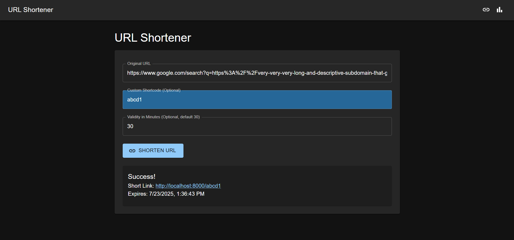
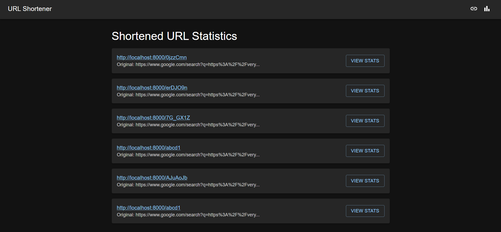

## 🚀 Features

- **Shorten URLs**: Convert long URLs into concise, easy-to-share links.
- **Custom Shortcodes**: Personalize your short links with custom codes.
- **Link Expiration**: Optionally set a time limit (in minutes) for link validity.
- **Usage Analytics**:
  - Total number of clicks
  - Timestamp of each click
  - Geographical location of the click
  - Referrer source (e.g., direct link, website, etc.)
- **Logging Middleware**: Logs backend and frontend events to an external service for monitoring/debugging.

---

## 🛠️ Tech Stack

| Layer      | Tech Used                    |
|------------|------------------------------|
| Backend    | Node.js, Express.js          |
| Frontend   | React, Material UI           |
| Utilities  | nanoid, axios                |

---

## 🧰 Prerequisites

- Node.js and npm installed
- A valid `access_token` for logging middleware

---

## ⚙️ Getting Started

### 1. Backend Setup

```bash
# Navigate to the backend directory
cd backend

# Install dependencies
npm install

# Replace "your_access_token_here" with your token in:
# backend/logger.js

# Start the backend server
npm start
````

📍 Server runs at: [http://localhost:8000](http://localhost:8000)

---

### 2. Frontend Setup

```bash
# Navigate to the frontend directory
cd frontend

# Install dependencies
npm install

# Replace "your_access_token_here" with your token in:
# frontend/src/utils/logger.js

# Start the frontend application
npm start
```

🌐 App opens at: [http://localhost:3000](http://localhost:3000)

---

## 📸 Screenshots

### 🔗 URL Shortener Input Page  


### 📊 Shortened URL List View  


### 📍 Detailed Analytics View  


---

## 📁 Project Structure

```
url-shortener-app/
│
├── backend/                # Express server
│   ├── routes/
│   ├── logger.js
│   └── ...
│
├── frontend/               # React app
│   ├── src/
│   │   ├── components/
│   │   └── utils/logger.js
│   └── ...
│
└── README.md
```

---


## 💬 Feedback

If you encounter any issues or have suggestions, feel free to open an issue or submit a pull request!

```
